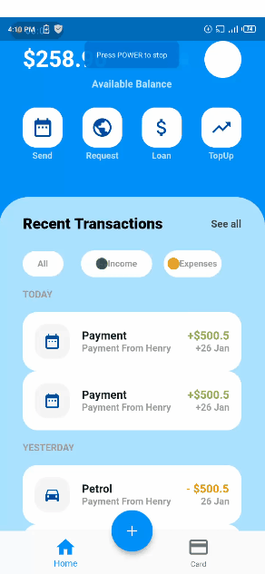

# walletui

A new Flutter application it's actually just a Ui.

A few resources to get you started if this is your first Flutter project:
- [Lab: Write your first Flutter app](https://flutter.dev/docs/get-started/codelab)
- [Cookbook: Useful Flutter samples](https://flutter.dev/docs/cookbook)

